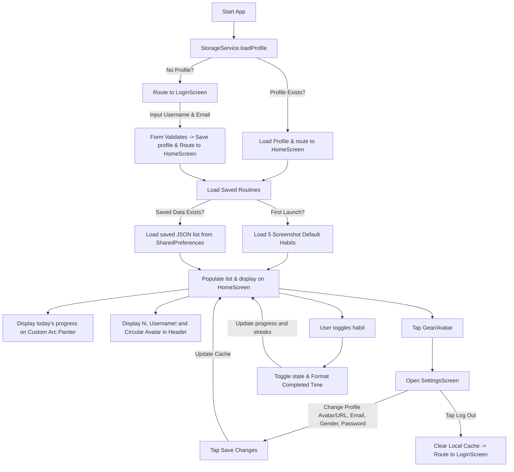

# PROJECT REPORT: ROUTINE TRACKER (TODAY'S TRACK)
**A Daily Habit and Schedule Tracker App for Students**

---

## 1. Introduction
The **Routine Tracker** (internally styled as **"Today's Track"**) is a lightweight, high-performance Flutter mobile application designed specifically for students to organize, manage, and track their daily habits and academic schedules. 

In a student’s life, time management is one of the most significant indicators of academic success. Students have to balance lectures, assignments, studying, exercise, drinking water, and leisure. This application provides a beautiful, dark-themed dashboard that visually counts progress, helps build consistency through day-based streaks, and keeps records secure and persistent using offline device storage.

The codebase is built strictly using core Flutter widgets and native state management (`setState`), avoiding over-engineered, heavy libraries. This makes it an ideal reference for beginner/intermediate developers, ensuring it remains clean, easy to read, and fully understandable for academic evaluation and project submissions.

---

## 2. Objective
The primary objectives of building the Routine Tracker application are:
1. **Promote Consistency**: To help students stick to their daily schedules by visually tracking consecutive completion days (streaks).
2. **Encourage Time Management**: To enable students to allocate custom time slots for their routines (e.g., "6 AM to 8 PM" or "All day") and organize their days productively.
3. **Provide Real-Time Visual Feedback**: To display a custom-designed semi-circular progress meter that instantly updates when habits are completed, giving a sense of accomplishment.
4. **Offer Offline Reliability**: To store all task lists and completion metrics directly on the device using local storage, ensuring it works without requiring active internet access.
5. **Demonstrate Academic Flutter Standards**: To display standard, best-practice Flutter code using stateful widgets, custom Canvas painting, and JSON serialization in a way that is easily presentable for college examinations.

---

## 3. Technologies Used
The application is built using modern, stable cross-platform technologies:
* **Flutter Framework**: An open-source UI toolkit created by Google to build beautiful, natively compiled applications for mobile, web, and desktop from a single codebase.
* **Dart Programming Language**: A client-optimized, object-oriented programming language designed for fast apps on any platform.
* **Shared Preferences (`shared_preferences`)**: A lightweight, platform-specific local storage plugin that stores key-value pairs (like strings, integers, and string lists) offline.
* **JSON Serialization**: Built-in library `dart:convert` used to convert complex custom Dart objects into simple strings and vice-versa, facilitating local storage.

---

## 4. Widgets Used
The entire user interface is constructed using standard Material Design widgets. Below is a detailed mapping of every major widget used and where it was applied:

### Core Screen Structures
* **`Scaffold`** (Used in `main.dart`, `home_screen.dart`, `add_routine_screen.dart`):
  * *Purpose*: Serves as the primary scaffold/canvas for our pages. It sets up the standard page structure, holding the `AppBar`, the scrollable screen `body`, and safe positioning.
* **`AppBar`** (Used in `home_screen.dart`, `add_routine_screen.dart`):
  * *Purpose*: The top header bar. It holds the title text ("Today's Track", "Add New Routine") and action buttons like settings in a clean, borderless dark layout.
* **`SafeArea`** (Used in `home_screen.dart`, `add_routine_screen.dart`, `login_screen.dart`, `settings_screen.dart`):
  * *Purpose*: Wraps the screens to automatically inject padding and protect the app content from overlapping with hardware notches, status bars, or home indicator bars.
* **`LoginScreen`** (New Core Widget in `lib/screens/login_screen.dart`):
  * *Purpose*: The gateway authentication form. It holds custom `TextFormField` validation fields capturing the student's username and email ID, styling a premium welcome page.
* **`SettingsScreen`** (New Core Widget in `lib/screens/settings_screen.dart`):
  * *Purpose*: The user profile management hub. Allows editing the username, email address, gender dropdown, and email password with visibility eye toggles.
* **`CircleAvatar` & `Image.network`** (Used in settings and dashboard header):
  * *Purpose*: Dynamically displays user profile pictures. If the student picks a local avatar emoji, it renders a custom styled gradient badge; if they provide a custom photo URL, it fetches the image securely from the web and uses an `errorBuilder` fallback.

### Layout Containers
* **`Column`** (Used in all layouts):
  * *Purpose*: A multi-child layout widget that displays its children in a vertical stack. We used it to lay out the header, progress arc, calendar, and habit list sequentially.
* **`Row`** (Used in `routine_card.dart` and forms):
  * *Purpose*: A layout widget that displays children horizontally. We used it inside cards to align titles alongside emojis, and on the bottom right to align timestamps with status indicators.
* **`Container`** (Used in custom paint bounds, weekly calendar cells):
  * *Purpose*: A highly versatile layout widget that allows custom decoration, margins, borders, and dimensions. Applied to size the custom progress arc box and draw yellow underline indicators on the active calendar day.
* **`Padding` & `SizedBox`** (Used globally):
  * *Purpose*: `Padding` prevents elements from sticking to screen boundaries by adding custom margins. `SizedBox` is a lightweight placeholder container used to inject fixed vertical and horizontal spaces (margins) between widgets.
* **`Expanded`** (Used to wrap the habit list and buttons):
  * *Purpose*: Tells Flutter to make a widget fill the entire remaining horizontal or vertical space. It is crucial inside the home screen `Column` to allow the `ListView` to grow and scroll without causing layout overflow errors.

### Visual Components
* **`AnimatedContainer`** (Used in `routine_card.dart`):
  * *Purpose*: An upgraded version of Container that automatically animates visual changes. When a user taps a card, it smoothly morphs the card's border color to bright yellow within 250 milliseconds.
* **`Card`** (Deprecated in favor of raw container, but represented by styled containers in `routine_card.dart`):
  * *Purpose*: Renders a rounded, elevate-able background box to group information. In our code, we custom-styled container borders and corners for a more premium, modern, glass-like look.
* **`ListTile`** (Represented by a custom Row format inside `RoutineCard`):
  * *Purpose*: Formatted row layout. We manually laid out a custom Row to have total control over the alignment of the Title, Subtitle, Streak flame, Frequency, and Delete icon.
* **`Text`** (Used everywhere):
  * *Purpose*: Renders text strings on screen. Styled with custom `TextStyle` for weights, font sizes, colors, and line-through effects.
* **`Icon`** (Used in buttons, time picker row, and widgets):
  * *Purpose*: Renders graphic symbols (like settings gears, edit pens, trash bins, and calendar grids) to provide instant visual context.

### Form Inputs & Buttons
* **`TextFormField`** (Used in `add_routine_screen.dart`):
  * *Purpose*: An editable text box that supports validation. Used to capture the name of the routine.
* **`DropdownButtonFormField`** (Used in `add_routine_screen.dart`):
  * *Purpose*: A dropdown selection list. Used for picking the routine's Category and Frequency, ensuring the data is strictly limited to pre-approved values.
* **`Checkbox`** (Used in `add_routine_screen.dart`):
  * *Purpose*: A binary toggle button. Applied to the "All day" switch to instantly disable or enable specific hour ranges.
* **`ElevatedButton` & `OutlinedButton`** (Used in `add_routine_screen.dart`):
  * *Purpose*: Primary action triggers. The yellow "Save" button uses `ElevatedButton` to draw attention, while the "Cancel" button uses `OutlinedButton` to remain secondary.
* **`TextButton`** (Used in bottom navigation bar):
  * *Purpose*: A flat button without borders. Used at the bottom of the home screen as the primary "+ Add new Routine" button.

### List Rendering
* **`ListView.builder`** (Used in `home_screen.dart`):
  * *Purpose*: Efficiently creates a scrollable, dynamically loading list of items. It takes the length of the list and dynamically instantiates cards only when they scroll onto the screen.

### Custom Rendering
* **`CustomPaint`** (Used in `home_screen.dart`):
  * *Purpose*: A highly advanced widget that accepts a custom painter to draw directly on the pixel canvas. Used to render our semi-circular progress meter.

---

## 5. Backend & Logic Explanation
The "backend" of this application runs completely offline and client-side, making it highly secure and zero-latency.

### State Management via `setState()`
State management is handled natively using Flutter's core `StatefulWidget` framework.
1. The `HomeScreen` holds the list of habits: `List<Routine> _routines`.
2. When a user interacts with the app (e.g., taps a card to toggle completion, deletes a task, or saves a new one), we wrap the list mutation code inside a `setState(() { ... })` block.
3. `setState` signals the Flutter engine that the data model has changed. Flutter immediately recalculates the build method, updates the circular progress calculations, shifts card colors, and triggers redrawing on the screen instantly.

### Persistent Local Storage: `shared_preferences`
Because mobile applications reset their internal memory variables when closed, we use the `shared_preferences` plugin to store our daily tracker:
1. `shared_preferences` writes data into a local XML/plist file on Android and iOS devices.
2. It can only store basic types (strings, doubles, lists of strings). It cannot store our custom `Routine` class directly.
3. Therefore, we use a custom JSON bridge to convert our objects back and forth.

### JSON Serialization & Deserialization
To save our custom list of objects in the simple key-value store, we serialize it:
1. **JSON Encoding (Saving)**:
   * Each `Routine` object is converted to a `Map<String, dynamic>` using the `toJson()` helper:
     ```dart
     Map<String, dynamic> toJson() {
       return {
         'title': title,
         'time': time,
         'category': category,
         'frequency': frequency,
         'streak': streak,
         'isCompleted': isCompleted,
         'completedTime': completedTime,
       };
     }
     ```
   * We loop through our list and run `jsonEncode()` on each map, converting the objects into a `List<String>` of raw JSON strings (e.g., `'{"title": "Drink Water", "isCompleted": true...}'`).
   * This string list is then written to SharedPreferences.
2. **JSON Decoding (Loading)**:
   * Upon startup, the app loads the `List<String>` from storage.
   * Each string is parsed back into a Map using `jsonDecode()`.
   * We pass the Map into our factory constructor `Routine.fromJson(Map<String, dynamic> json)` to recreate actual `Routine` objects:
     ```dart
     factory Routine.fromJson(Map<String, dynamic> json) {
  return Routine(
    title: json['title'] ?? '',
    time: json['time'] ?? '',
    category: json['category'] ?? '',
    frequency: json['frequency'] ?? '',
    streak: json['streak'] ?? 0,
    isCompleted: json['isCompleted'] ?? false,
    completedTime: json['completedTime'],
  );
}
```

### Persistent User Profile Cache
To support custom logins and setting modifications, the app features an offline user cache:
1. **Data Model (`lib/models/user_profile.dart`)**: Combines properties for `username`, `email` (Mail ID), `gender` selection, `password` (Mail password), and `avatarKey` configuration.
2. **Profile Serialization**: Convert the custom object into a single JSON map (`toJson()`), convert to string using `jsonEncode()`, and store in SharedPreferences under `user_profile`.
3. **Dynamic App Startup Check**: When the app boots, `main.dart` queries the profile cache. If the key exists, it opens `HomeScreen` immediately (providing a smooth session recovery experience); if empty, it boots into the gorgeous `LoginScreen`.

---

## 6. Project Flow
Below is the step-by-step logical lifecycle of how the app handles routine activities:



1. **Session Control**: The app automatically detects if the student is logged in. On a fresh installation, they enter their credentials.
2. **Dashboard Integration**: The home dashboard header updates in real-time, greeting the user by their custom name with a styled profile photo button that acts as the settings gateway.
3. **Settings Form**: Inside settings, users can select an offline illustration badge from the avatar grid or input any web image URL.
4. **Log Out Execution**: Tapping Log Out deletes the cached profile, resets the habit lists, and returns the app cleanly to the startup Login gate.

---

## 7. Challenges Faced
Developing a custom mobile app presents several realistic challenges that an intermediate student would face:
1. **Custom Gauge Math (Arc Painter)**:
   * *Challenge*: Standard circular progress indicators draw a full 360-degree loop. Drawing a perfect semi-circle (180 degrees) from left to right requires manual math in radians ($180^{\circ} = \pi$ radians) and bounding box configuration.
   * *Solution*: Created a custom bounding box `Rect.fromLTWH` that is twice as tall as the target size and painted the sweep angle exactly as `pi * progress`, resulting in a perfect, centered arc.
2. **Persistent Complex Lists**:
   * *Challenge*: The `shared_preferences` package cannot save custom object structures. 
   * *Solution*: Implemented custom `toJson()` and `fromJson()` mapper scripts, transforming complex Dart object lists into readable string lists for persistent local storage.
3. **Synchronizing Screen Navigation**:
   * *Challenge*: Passing data back from a second screen when popped from the navigation stack.
   * *Solution*: Implemented an asynchronous navigator push: `final Routine? newRoutine = await Navigator.push(...)` and returned the custom model using `Navigator.pop(context, newRoutine)`.
4. **Infinite Animation Loops in Widget Tests**:
   * *Challenge*: Using the standard `tester.pumpAndSettle()` in automated widget tests would timeout and fail. This occurred because our dashboard loading state utilizes a spinning `CircularProgressIndicator` which spins indefinitely.
   * *Solution*: Replaced the settling method with a microsecond-based frame pump `tester.pump(const Duration(milliseconds: 100))`, allowing mock databases to initialize and immediately rendering the `LoginScreen` safely.
5. **Secure Form Validation and Visibility toggles**:
   * *Challenge*: Providing password editing without exposing sensitive values on screen or executing invalid inputs.
   * *Solution*: Configured strict validator regular expressions for email inputs, and integrated visual state controllers toggling obscure text values inside trailing icon triggers.

---

## 8. Future Improvements
While the app is fully functional and ready for submission, it could be expanded in the future with:
1. **Push Notifications**: Daily alerts to remind students to complete their streak before midnight.
2. **Weekly Performance Reports**: A bar graph dashboard visualizing completion stats over the past month.
3. **Cloud Synchronization (Firebase/Supabase)**: User login to synchronize habits across multiple devices (phone, tablet, computer).
4. **Multiple Category Icons**: A larger suite of custom graphic emojis for customized study and leisure routines.

---

## 9. Conclusion
The **Routine Tracker** is a highly efficient, beautiful, and stable mobile application tailored for student evaluation. It successfully integrates modern layout designs (inspired by high-end dark habit trackers) with lightweight backend code. By using core Flutter building blocks, readable custom painters, and direct offline saving, the project demonstrates a robust, complete, and practical understanding of client-side mobile application architecture.
